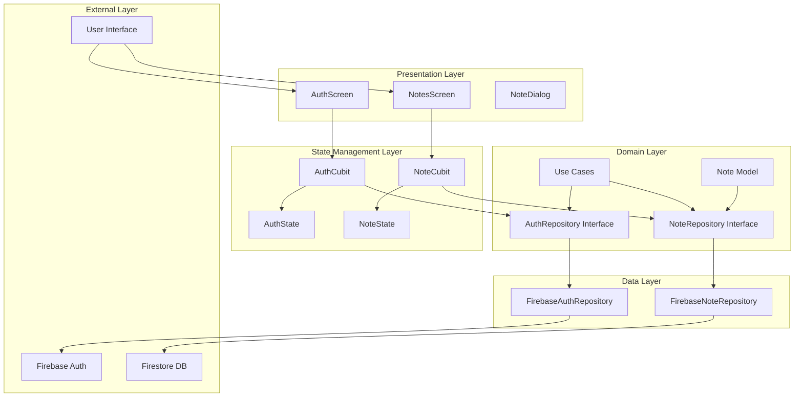
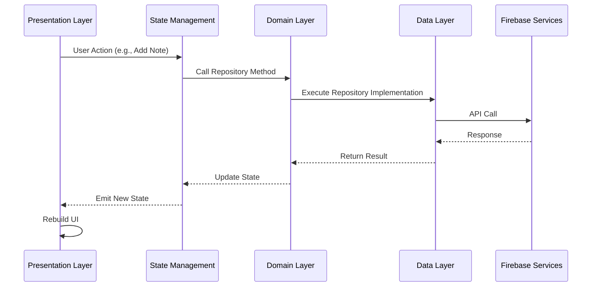

# Notes App Architecture Documentation

## 🏗️ Clean Architecture Overview

This project implements **Clean Architecture** principles as defined by Robert C. Martin, ensuring separation of concerns, testability, and maintainability.

## 📊 Architecture Diagram



## 🔄 Data Flow Diagram



## 📁 Layer Responsibilities

### 1. Presentation Layer (`presentation/`)
**Purpose**: Handle user interface and user interactions

**Components**:
- `AuthScreen`: Login/signup interface
- `NotesScreen`: Main notes list and management
- `NoteDialog`: Add/edit note dialogs

**Responsibilities**:
- Display UI components
- Handle user input
- Show loading states and feedback
- Navigate between screens

### 2. State Management Layer (`state/`)
**Purpose**: Manage application state and business logic

**Components**:
- `AuthCubit`: Authentication state management
- `NoteCubit`: Notes state management
- `AuthState`: Authentication states
- `NoteState`: Notes states

**Responsibilities**:
- Hold application state
- Process business logic
- Communicate with repositories
- Emit state changes

### 3. Domain Layer (`domain/`)
**Purpose**: Define business rules and entities

**Components**:
- `Note`: Note entity model
- `AuthRepository`: Authentication repository interface
- `NoteRepository`: Notes repository interface

**Responsibilities**:
- Define business entities
- Define repository contracts
- Implement business rules
- Independent of external frameworks

### 4. Data Layer (`data/`)
**Purpose**: Implement data access and external service integration

**Components**:
- `FirebaseAuthRepository`: Firebase Auth implementation
- `FirebaseNoteRepository`: Firestore implementation

**Responsibilities**:
- Implement repository interfaces
- Handle data persistence
- Manage external API calls
- Data transformation

## 🔧 Dependency Injection

The app uses **flutter_bloc** for dependency injection:

```dart
MultiRepositoryProvider(
  providers: [
    RepositoryProvider<AuthRepository>(
      create: (_) => FirebaseAuthRepository()
    ),
    RepositoryProvider<NoteRepository>(
      create: (_) => FirebaseNoteRepository()
    ),
  ],
  child: BlocProvider<AuthCubit>(
    create: (context) => AuthCubit(
      repository: context.read<AuthRepository>()
    ),
    child: MaterialApp(...)
  ),
)
```

## 🎯 State Management Strategy

### AuthCubit States
```dart
abstract class AuthState {}
class AuthInitial extends AuthState {}
class AuthLoading extends AuthState {}
class AuthAuthenticated extends AuthState { final String userId; }
class AuthUnauthenticated extends AuthState {}
class AuthError extends AuthState { final String message; }
class AuthSuccess extends AuthState { final String message; }
```

### NoteCubit States
```dart
abstract class NoteState {}
class NoteInitial extends NoteState {}
class NoteLoading extends NoteState {}
class NoteLoaded extends NoteState { final List<Note> notes; }
class NoteEmpty extends NoteState {}
class NoteError extends NoteState { final String message; }
class NoteActionSuccess extends NoteState { final String message; }
```

## 🔒 Security Architecture

### Authentication Flow
1. User enters credentials
2. AuthCubit calls FirebaseAuthRepository
3. Firebase Auth validates credentials
4. Success: User authenticated, navigate to Notes
5. Failure: Show error message

### Data Access Control
- Users can only access their own notes
- Firestore security rules enforce access control
- Repository pattern abstracts data access

## 📊 Performance Optimizations

### State Management
- Minimal state updates
- Efficient widget rebuilds
- Proper disposal of resources

### Data Access
- Optimized Firestore queries
- Caching strategies
- Error handling and retry logic

## 🧪 Testing Strategy

### Unit Testing
- Repository implementations
- Cubit logic
- Domain models

### Widget Testing
- UI components
- User interactions
- State changes

### Integration Testing
- End-to-end workflows
- Firebase integration
- Authentication flows

## 🔄 Error Handling

### Network Errors
- Retry mechanisms
- User-friendly error messages
- Graceful degradation

### Validation Errors
- Input validation
- Clear error feedback
- Form state management

## 📈 Scalability Considerations

### Code Organization
- Modular architecture
- Clear separation of concerns
- Easy to extend and modify

### Performance
- Efficient state management
- Optimized data access
- Minimal memory footprint

### Maintainability
- Clean code principles
- Comprehensive documentation
- Consistent coding standards

---

This architecture ensures the app is **testable**, **maintainable**, and **scalable** while following Flutter and Dart best practices. 