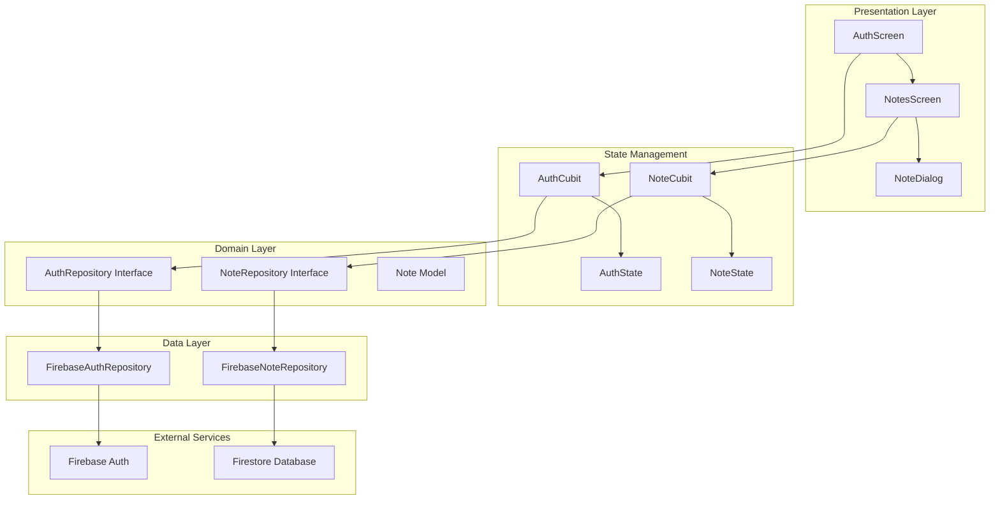

# Notes App - Individual Assignment 2

A Flutter application for taking notes with Firebase authentication and Firestore database integration. This app demonstrates clean architecture principles, state management with Bloc/Cubit, and full CRUD operations for notes.

## 🏗️ Architecture Overview

This project follows **Clean Architecture** principles with clear separation of concerns:

```
lib/
├── data/           # Data layer - Firebase implementations
├── domain/         # Domain layer - Models and repository interfaces
├── presentation/   # UI layer - Screens and widgets
├── state/          # State management - Bloc/Cubit
└── main.dart       # App entry point
```

### Architecture Diagram



## 🚀 Features

### Authentication
- ✅ Email/password signup and login
- ✅ Input validation with error messages
- ✅ Persistent authentication state
- ✅ Secure logout functionality

### Notes Management
- ✅ Create new notes
- ✅ Read and display all user notes
- ✅ Update existing notes
- ✅ Delete notes with confirmation
- ✅ Real-time Firestore synchronization

### User Experience
- ✅ Loading indicators during operations
- ✅ Success/error feedback via SnackBars
- ✅ Empty state handling
- ✅ Responsive design for different screen sizes
- ✅ Clean Material Design UI

## 🛠️ Technology Stack

- **Framework**: Flutter 3.x
- **Language**: Dart
- **State Management**: flutter_bloc (Cubit)
- **Backend**: Firebase
  - Authentication: Firebase Auth
  - Database: Cloud Firestore
- **Architecture**: Clean Architecture
- **Platform**: Android, iOS, Web

## 📋 Prerequisites

- Flutter SDK (3.1.0 or higher)
- Dart SDK (3.1.0 or higher)
- Android Studio / VS Code
- Firebase project with Authentication and Firestore enabled

## 🔧 Setup Instructions

### 1. Clone the Repository
```bash
git clone <your-repository-url>
cd individual_assignment_notes
```

### 2. Install Dependencies
```bash
flutter pub get
```

### 3. Firebase Configuration

#### For Android:
1. Download `google-services.json` from Firebase Console
2. Place it in `android/app/`
3. Ensure Google Services plugin is configured in build files

#### For iOS:
1. Download `GoogleService-Info.plist` from Firebase Console
2. Place it in `ios/Runner/`

#### For Web:
1. Add Firebase configuration to `web/index.html`

### 4. Firestore Security Rules
Set up the following security rules in Firebase Console:
```javascript
rules_version = '2';
service cloud.firestore {
  match /databases/{database}/documents {
    match /users/{userId}/notes/{noteId} {
      allow read, write: if request.auth != null && request.auth.uid == userId;
    }
  }
}
```

### 5. Run the Application
```bash
flutter run
```

## 📱 App Flow

1. **Authentication Screen**: Users can sign up or log in
2. **Notes Screen**: After authentication, users see their notes
3. **Empty State**: New users see "Nothing here yet—tap ➕ to add a note"
4. **CRUD Operations**: Add, edit, delete notes with real-time updates
5. **Logout**: Return to authentication screen

## 🧪 Testing

### Manual Testing Checklist
- [ ] Sign up with new email/password
- [ ] Login with existing credentials
- [ ] Add new notes
- [ ] Edit existing notes
- [ ] Delete notes with confirmation
- [ ] Logout and verify session ends
- [ ] App restart maintains authentication
- [ ] Error handling for invalid inputs
- [ ] Network error handling

### Dart Analyzer Report
Generate the analyzer report:
```bash
flutter analyze > analyzer_report.txt
```

## 📁 Project Structure

```
lib/
├── data/
│   ├── firebase_auth_repository.dart    # Firebase Auth implementation
│   └── firebase_note_repository.dart    # Firestore implementation
├── domain/
│   ├── auth_repository.dart             # Auth repository interface
│   ├── note.dart                        # Note model
│   └── note_repository.dart             # Notes repository interface
├── presentation/
│   ├── auth_screen.dart                 # Login/signup screen
│   └── notes_screen.dart                # Main notes interface
├── state/
│   ├── auth_cubit.dart                  # Authentication state management
│   ├── auth_state.dart                  # Auth states
│   ├── note_cubit.dart                  # Notes state management
│   └── note_state.dart                  # Note states
└── main.dart                            # App entry point
```

## 🔒 Security Features

- User authentication required for all operations
- Users can only access their own notes
- Secure Firestore rules prevent unauthorized access
- Input validation prevents malicious data

## 📊 Performance Considerations

- Efficient state management with Cubit
- Minimal widget rebuilds
- Optimized Firestore queries
- Proper disposal of controllers and listeners

## 🐛 Known Issues

- Network connectivity issues may affect Firebase operations
- Requires stable internet connection for full functionality
- Firebase configuration must be properly set up

## 📝 Assignment Requirements Met

### ✅ Authentication Flow
- Sign-up and log-in with email/password
- Input validation with clear error messages
- Persistent authentication state
- Proper logout functionality

### ✅ CRUD Operations
- Create: Add new notes via dialog
- Read: Fetch and display all user notes
- Update: Edit existing notes
- Delete: Remove notes with confirmation

### ✅ State Management
- Bloc/Cubit for all state changes
- No setState() for business logic
- Clean separation of concerns

### ✅ User Interface
- Material Design components
- Loading indicators
- Success/error feedback
- Empty state handling
- Responsive design

### ✅ Code Quality
- Clean architecture implementation
- Proper error handling
- Input validation
- Security considerations

## 🤝 Contributing

This is an individual assignment project. For questions or issues, please refer to the assignment guidelines.

## 📄 License

This project is created for educational purposes as part of Individual Assignment 2.

---

**Note**: This app requires Firebase configuration to function properly. Please follow the setup instructions above to configure your Firebase project.
